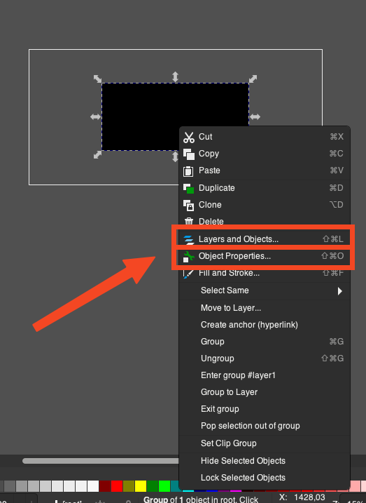
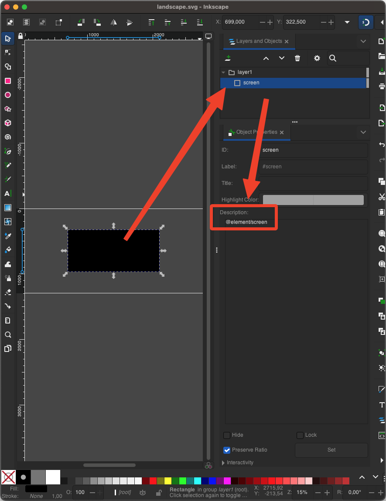
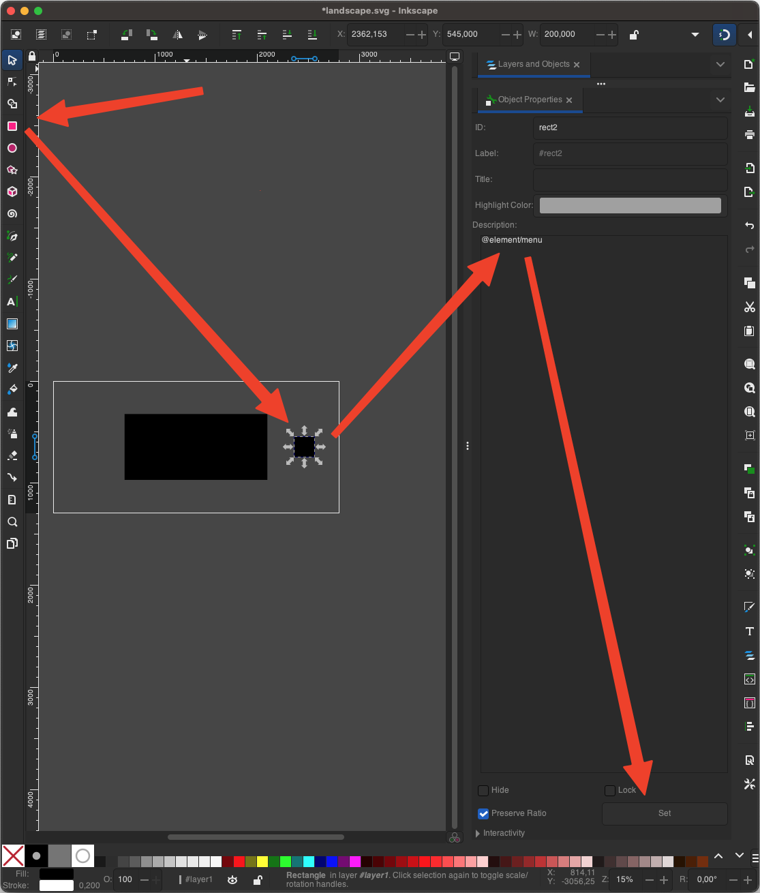

# Skin Creation Guide

This guide will help you create a `deltaskin` file that can be used with the Delta and Ignited Emulator, from scratch using all features of this tool.

## Installation and Initialization

Please make sure you have a recent (and supported) version of node and npm installed. From your empty project directory, run the following command to initialize a new project:
    
```bash
npx delta-skin-generator@latest init
```

You can reduce the scope of your skin by supplying the filter arguments [`--representations`, `--orientations` and/or `--altSkin`](api.md#cli).

The `init` command will ask for some properties of your skin to populate the [`skin.json` file](api.md#skinjson) and create three folders (`components`, `representations`, `elementConfig`) in your project directory. 

 - `skin.json` file is where you will define the general properties of your skin. This is defining top level properties in the [`info.json`](https://noah978.gitbook.io/delta-docs/skins#the-info.json) file.
 - `components` folder is where you will store all your SVG components that will be used in your skin. The components should be named using only alphanumeric characters.
 - `elementConfig` folder is where you will store your element configuration files. The element configuration files are in JSON format and should be named using only alphanumeric characters.
 - The `representations` folder is where you will store all your viewport SVG files. Within the `representations` folder, you will find subfolders for each device type (`iphone-standard`, `iphone-e2e`, `ipad-standard`, `ipad-splitview`). Each of these subfolders will contain the viewport SVG files for the respective orientation and alternative representation. The viewport SVG files should be named `portrait.svg`, `portrait-alt.svg`, `landscape.svg`, and `landscape-alt.svg`.

## Creating a representation

1. Open any of the created template representations form the `representations` folder in your vector editor of choice. For this tutorial I'll be using [Inkscape](https://inkscape.org/), as it is free and the annotation specifications are based on its capabilities. However if you have better ideas on how to annotate, I'd be happy to consider alternative approaches.
2. The template already contains a rectangle. Go into the "Object Properties" and see the annotations:

<p align="center">
    </img>
    </img>
</p>

3. We can now add additional elements that will represent the skin. For that add rectangles and add annotations in the description field - don't forget to "Set" the properties in the bottom right corner. The following creates a `menu` button

<p align="center">
    </img>
</p>

4. To compile the skin into a `.deltaskin` file, run the following command:
```bash
npx delta-skin-generator@latest
```
5. Transfer the generated file from the `dist` folder onto your device and [load your skin](https://docs.ignitedemulator.com/using-ignited/settings/controller-skins).
6. In the emulator's pause screen, you can enable keyboard debugging to see the active areas.

## Creating a component

In order to have variations of the skin for various orientations and devices, we can create components that can be reused in multiple representations.

1. Create a new SVG file in the `components` folder and create any component, e.g. a 'menu' button, within a file called `menu.svg`. Make sure your component fills the full canvas.

2. Add a component annotation to the existing descriptions:
3. This will fully replace the rectangle and all child components to render the component using the rectangles original dimensions.
4. Compile and transfer the skin to your device to see the changes.

## Element Configuration

Elements can be further configured (e.g. in order to allow `extendedEdges` for certain components). Each annotation either creates an `item` or `screen` object in the `info.json` file. The contents of a configuration file will be merged with the generated object and allows for full flexibility. To specify the use of a configuration file, add the name of the file (without the `.json` extension) to the annotation:
``` 
@element/dpad/dpadConfig"
```

## What's next?

- Check out the [API documentation](api.md) for more details on all available configuration options and annotations.
- If you plan to distribute your skin, check out the [Github Actions guide](github.md) to automate the build and release process.

## Projects

Below is a list of open source skins utilizing this framework:
- [PokeMaxDS by steilerDev](https://github.com/steilerDev/delta-skin-PokeMaxDS)